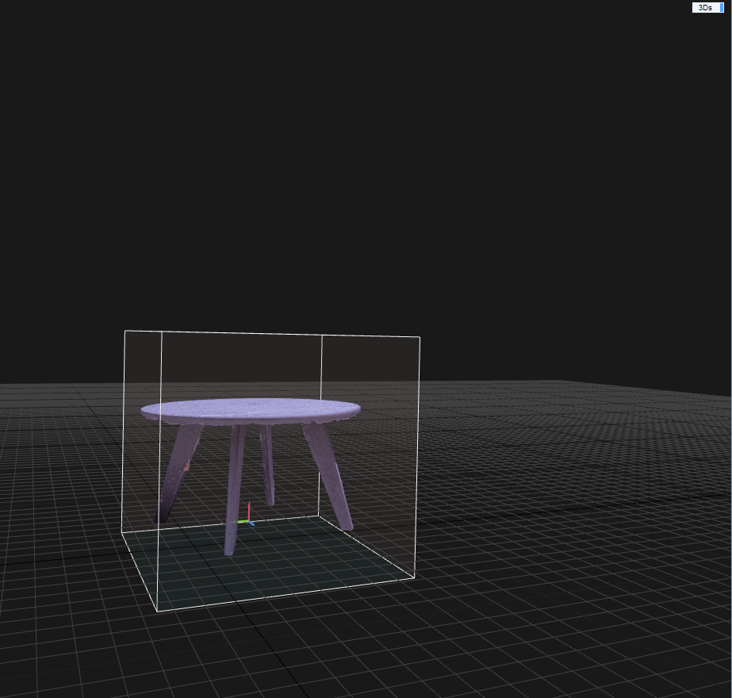
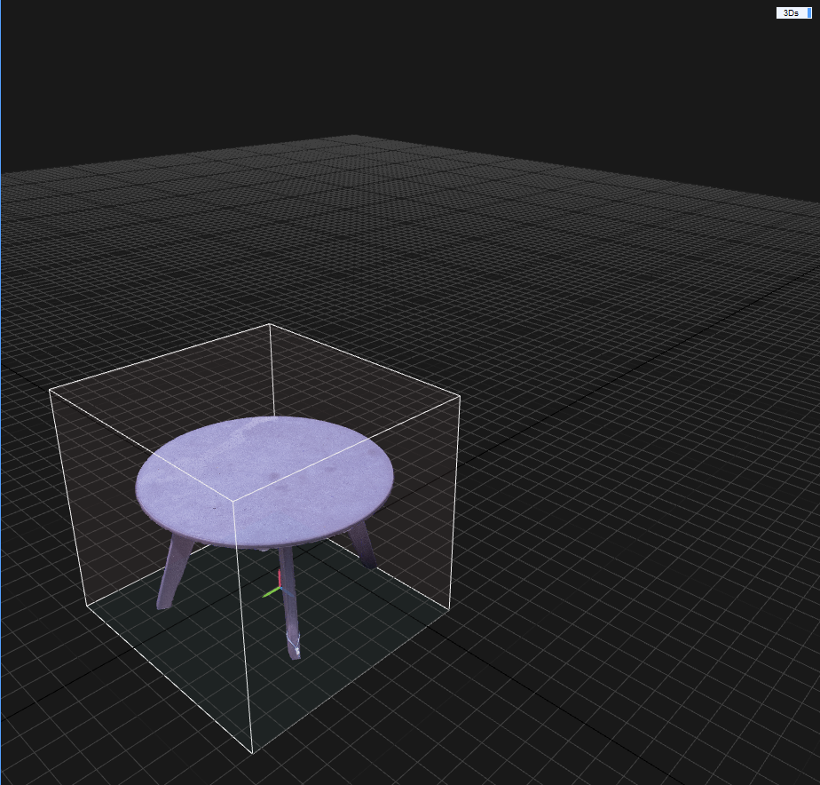
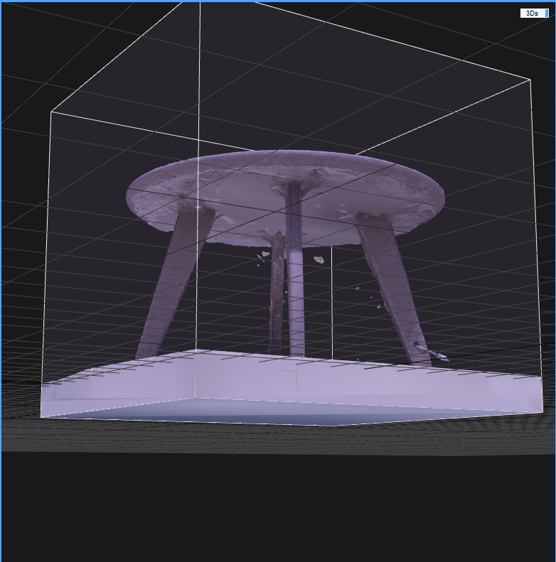
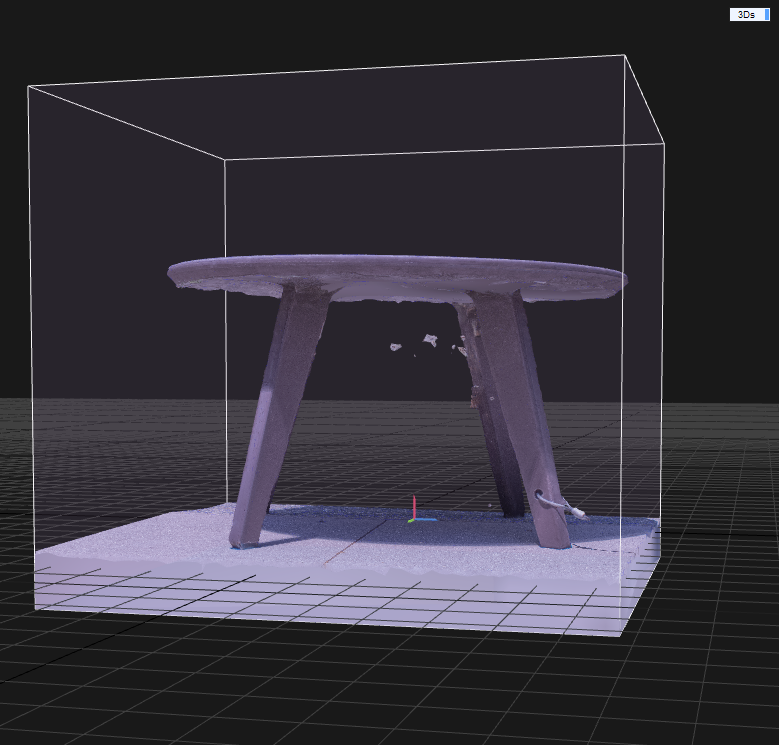

# Report June 15th 2022
### Summary: 
I started playing around with UE5, and learned some basic commands. Got access to the Reality Capture software and created a model of a stool. The stool gave minor problems, and I am looking forward to creating more models.
## Activities/Went through:
 * Photogrammetry: 
   * Shot another 70ish photos of the stool. This time more of the lower angles. The weather conditions were similar to the first batch of photos. No overcast, very sunny weather. Corrected the exposure to some images. I corrected the highlights (lowered) and the shadows(increased). 
   * Got access to the Reality Capture software as a trial license. The license will last until July 13th 2022. 
   * Started experimenting with Reality Capture. I combined the initial 120ish photos with the ones from this week. I ended up experimenting with a total of 200 photos of the Estella Courtyard stool. 
   * Learned to use the basic commands on Reality Capture, like importing form image, folder or video sequence. 
   * Learned to align, create a mesh model, and texturized a model.
   * Initially the model was missing the legs in the point cloud after alignment, and it would miss them when I tried working with the preview mesh. Since the preview is a quick mesh model, then it wouldn't as long to generate a model. However, when I tried working with the normal quality mesh model we got a full stool to work. 
   * After generating this model, we texturized it with the tool in Reality Capture. After this, the processing came down to trimming the bottom and getting rid of particles in the air that resembled some leafs and spider webs. Final result is attached.
   * Went through the initial commands on Unreal Engine. 
   * Played around with UE5 on how to make a basic house/model
    
    
## Problems/Issues 
 * I had a hard time getting good detail if any on the bottom of the stool's photogrammety model. Here are some of the photos form the bottom:
 * 
 * 
 * While I believe the model to very accurate to what we are looking for, there is still some improvement in the technique for taking photos. I believe that we can achieve the same result with a couple less pictures. It is a subject to test, but I believe the software is efficient in modeling. I would like to keep experimenting 
## Plans/ Agenda for week of June 15th-22nd:
 * I have not been working on the machine learning side of things. I am hoping to work on a tutorial this upcoming week, or at least get started on one. 
 * I want to go through some Unix commands tutorials.
 * Scan more objects on the Estella courtyard to create photogrammety models. 
 * Get clearer models.
